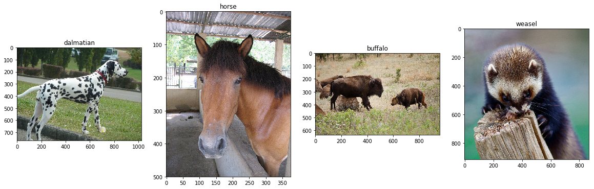

### Creating custom Dataset classes in PyTorch

PyTorch, like Tensorflow is a Deep Learning Framework for Python, that is especially popular in the research space. Unlike Tensorflow which is better when it comes to deploying neural network to production, PyTorch is simple to setup and easy to debug and is more pythonic. Even with it’s simplicity, it offers maximum flexibility and speed.

Along with the research field, PyTorch is also quite popular among the community of people are into kaggle contests and similar online contests like them. I’ll try to give some insight on mainly the Image related contests there. All Deep Learning frameworks have very easy support for Datasets where each class of images are in it’s individual folders.

    root/dog/xxx.png
    root/dog/xxy.png
    root/dog/xxz.png
    ...
    root/cat/123.png
    root/cat/nsdf3.png
    root/cat/asd932_.png

Unfortunately though, most of the contest online don’t have their data in the above format. They usually have all the images inside one folder called “train” and then there is a CSV which maps the filename with it’s respective category. There are two ways to handle this — 

-   Write a script to iterate through the CSV and create the folders for all the available classes and move the images to the respective folders
-   Create custom Dataset classes to handle it.

Which one is a better choice, would depend on your situation, but I am here to give an insight of how to do the second point.

**DATASET** — I will be using a data set which is currently being used in a [Deep Learning Beginner](https://www.hackerearth.com/challenge/competitive/deep-learning-beginner-challenge/machine-learning/predict-the-energy-used-612632a9-9de79188/) challenge at Hackerearth. If you want to have a look at it, you can download it from [this](https://s3-ap-southeast-1.amazonaws.com/he-public-data/DL%23+Beginner.zip) link provided in the contest page. Note that you need to use 7zip to unzip the folder.

The dataset has two folders train and test, which has all the images in it. The labelling is done in a CSV file which looks something like this. 

|  | Image_id | Animal |
|--|--|--|
|0| Img-1.jpg | hippopotamus |
|1| Img-2.jpg | squirrel |
|2| Img-3.jpg | grizzly+bear |
|3| Img-4.jpg | ox |
|4| Img-5.jpg | german+shepherd |

Let's visualise some of the data. 

